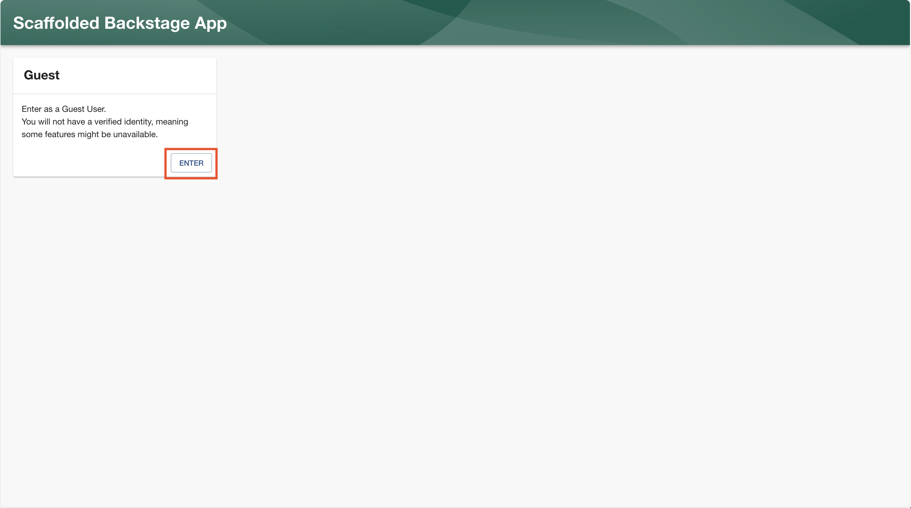

# dmTECH PL Recruitment Task

## Prerequisites:
- [Yarn](https://yarnpkg.com/) 4.4.1
- [Node.js](https://nodejs.org/en) 22.14.0

## How to Run the Project

1. Navigate to the project root directory and run the following command to install dependencies:
   ```bash
   yarn install
   ```
2. After the installation is complete, run the following command to start the development server:
   ```bash
   yarn dev
   ```
   This command starts both the frontend and backend of the project. If you want to run them separately, you can use the following commands:
3. To start the frontend server, run:
   ```bash
   yarn start
   ```
4. To start the backend server, run:
   ```bash
   yarn start:backend
   ```

All other commands are available in the [package.json](./package.json) file.

After running the project, you can access the frontend at [http://localhost:3000](http://localhost:3000) and the backend at [http://localhost:7007](http://localhost:7007).

To log in to the application, simply click on the `ENTER` button on the login page to log in as a guest.



## Recruitment Task

After logging in, you can navigate to the task by using the sidebar item that will take you to the plugin with the recruitment task.


The plugin presents a Star Browser, which is a list of stars with multiple parameters describing them. The data is loaded from the [stars.json file](./plugins/recruitment-task/src/data/stars.json).

### Obligatory Tasks

1. Go to the [components directory](./plugins/recruitment-task/src/components) and edit the existing React components to transform the data into a more user-friendly format by organizing it into a table instead of a list. You can utilize components from [MUI](https://mui.com/, but **please** don't use `DataGrid`, do it from the scratch) (Backstage uses version 4, which is already installed, but feel free to use a newer version) or [Backstage](https://backstage.io/storybook/). Of course, you can also use any other library or even native HTML elements, it's up to you.
2. Add interactive, functional filters for the data in the table:
   * Filter by the star name
   * Filter by star radius - display only stars larger than the value provided in the input
   * Add an additional filter, other than the two above - this is up to the candidate
3. [Commit](https://github.com/git-guides/git-commit) the changes and [push](https://github.com/git-guides/git-push) them to the repository

Focus on completing the tasks above to the best of your ability. The tasks below are optional and are not required to be completed.
While grading the task, we will focus on creativity, attention to detail, and how clear the solutions are.

### Optional Tasks
1. Create a backend plugin that will return data from the JSON file and fetch it in the frontend plugin, then display it in the previously created table. You can use the [Backstage backend plugin](https://backstage.io/docs/plugins/backend-plugin/) to create a backend plugin.
2. Currently, the data is displayed or not based on the value of the `isVisible` variable located in the [StarBrowser.tsx](./plugins/recruitment-task/src/components/StarBrowser/StarBrowser.tsx). Its value is set to `true`, but we would like to have the ability to set it using the `app-config.yaml` configuration file. The setting already exists in the configuration file, but there is a problem with reading its value. The task is to fix this problem - refer to the Backstage documentation. Remember to restart the development server after each change in the `app-config.yaml` file.
3. [Commit](https://github.com/git-guides/git-commit) the changes and [push](https://github.com/git-guides/git-push) them to the repository
